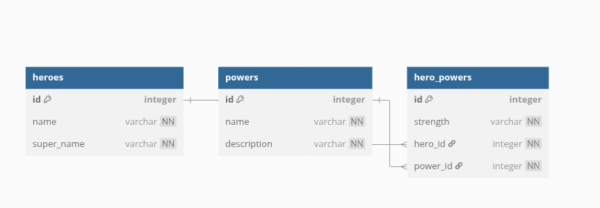

# 🦸 Superheroes API

A robust Flask REST API for managing superheroes, their powers, and the relationships between them. Built with Flask-SQLAlchemy and following RESTful principles.


## 📦 Features

- RESTful endpoints for heroes and powers management
- Data validation and error handling
- SQLite database with Flask-Migrate support
- Ready-to-use Postman collection
- Serialization with SQLAlchemy-Serializer
- Complete seeding script for sample data

## 🚀 Getting Started

### Prerequisites

- Python 3.8+
- pipenv (recommended)
- Postman (optional for testing)

### Installation

1. Clone the repository:
   ```bash
   git clone https://github.com/yourusername/superheroes-api.git
   cd superheroes-api
2. Set up virtual environment and install dependencies:

    ```bash
    pipenv install
    pipenv shell

3. Configure the database:

    ```bash
    flask db init
    flask db migrate -m "initial migration"
    flask db upgrade

4. Seed the database with sample data:

    ```bash
    python server/seed.py

5. Start the development server:

    ```bash
    python server/app.py
The API will be available at http://localhost:5555

# 📚 API Documentation
## Endpoints
### Heroes
GET /heroes - List all heroes

GET /heroes/<int:id> - Get hero details including their powers

### Powers
GET /powers - List all powers

GET /powers/<int:id> - Get power details

PATCH /powers/<int:id> - Update a power's description

### Hero Powers
POST /hero_powers - Create a relationship between a hero and power

## Request/Response Examples
### Get All Heroes

 
GET /heroes

Response:

    
    [
        {
            "id": 1,
            "name": "Kamala Khan",
            "super_name": "Ms. Marvel"
        },
      ...
    ]


### Get Hero Details


GET /heroes/1

Response:

    
    {
    "id": 1,
    "name": "Kamala Khan",
    "super_name": "Ms. Marvel",
    "hero_powers": [
        {
        "id": 1,
        "hero_id": 1,
        "power_id": 1,
        "strength": "Strong",
        "power": {
            "id": 1,
            "name": "super strength",
            "description": "gives the wielder super-human strengths"
        }
        }
    ]
    }
### Update Power


PATCH /powers/1

Content-Type: application/json

    {
        "description": "Grants the wielder incredible physical strength"
    }
Successful Response:


    {
        "id": 1,
        "name": "super strength",
        "description": "Grants the wielder incredible physical strength"
    }
Error Response:


    {
        "errors": ["Description must be present and at least 20 characters long"]
    }


# 🛠️ Development
## Project Structure

    superheroes/
    ├── instance/           # Database files
    ├── migrations/         # Database migrations
    ├── server/
    │   ├── __init__.py     # Package initialization
    │   ├── app.py          # Main application and routes
    │   ├── models.py       # Database models
    │   └── seed.py         # Database seeding script
    ├── .env                # Environment variables
    ├── Pipfile             # Dependencies
    └── README.md           # This file

## Testing with Postman
Import the provided Postman collection

Set the base URL to http://localhost:5555

Explore all available endpoints

# Database Schema
## Diagram




# 🙏 Acknowledgments
Flask and SQLAlchemy teams

Flatiron School curriculum

All the superheroes who inspired this project


This README includes:

1. **Visual badges** for quick status checks
2. **Detailed setup instructions** with code blocks
3. **Complete API documentation** with examples
4. **Project structure** overview
5. **Database schema visualization** using Mermaid
6. **Testing instructions** for Postman
7. **License and acknowledgments**

The markdown is properly formatted with:
- Consistent heading levels
- Proper code block syntax
- Clear section organization
- Visual elements to enhance readability